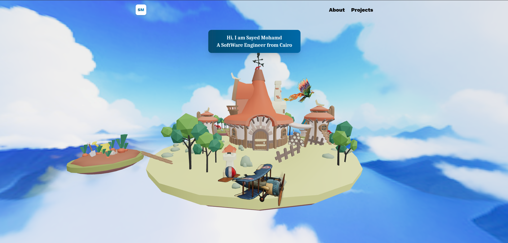

# 3D Interactive Portfolio

> A modern, interactive 3D portfolio built to showcase my projects, skills, and journey as a Frontend Developer.

Welcome to my **3D Portfolio** — a personal website designed to be more than just a traditional portfolio.

Instead of presenting my work through static sections, I built an **interactive 3D experience** that combines modern frontend development with immersive visuals and smooth interactions.

## overview 

  

##  Features

*  Interactive 3D environment
*  Modern and responsive UI
* Smooth animations and transitions
*  Fully responsive across devices
*  Client-side navigation with React Router
*  Dedicated projects showcase
*  Contact section
*  Clean and reusable component structure

##  Built With

* **React.js** — Frontend framework
* **Three.js** — 3D graphics and interactive scenes
* **React Three Fiber** — React renderer for Three.js
* **Tailwind CSS** — Styling and responsive design
* **React Router** — Client-side routing
* **Vite** — Development and build tooling

## Explore the Portfolio

 **Live Demo:**
[Visit My Portfolio](https://portfolio-v2-rho-red.vercel.app/)

##  Project Structure

The project follows a reusable and organized React architecture, separating:

* Components
* Pages
* Constants
* Assets
* 3D elements
* Routing
* Reusable UI sections

This makes the project easier to maintain, extend, and scale.

## Purpose

I built this project to challenge myself beyond standard CRUD applications and explore how **3D experiences can be integrated into modern web applications**.

It also represents my approach to frontend development:

**Clean code + good UI + interaction + performance.**

## About Me

I'm **Sayed Mohamed**, a Computer Science student and Frontend Developer interested in building modern web experiences and continuously improving my skills in software engineering.

I'm currently focused on **React, TypeScript, modern frontend architecture, and backend development**.

If you like the project, feel free to ⭐ the repository or check out some of my other projects.

---

